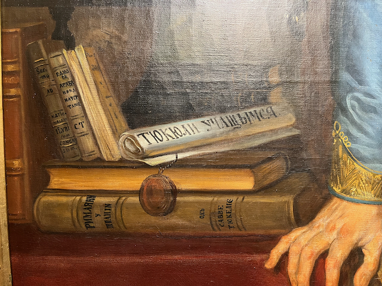

# История одного фото
# ТЮКЮЛИ УЧАЩЫМСЯ.

_Картина без названия висит в зале галереи ["Матицы Сербской"](https://maps.app.goo.gl/8rvE8eYMjg296xjJ6), это парадный портрет Саве Текелиjе._

Меня на картине привлекло наличие кириллической надписи на картине с явно центрально-европейским уклоном. Это парадный портнет, и все на нем должно иметь свой смысл и подавать явные сигналы о том, кто изображен на портрете. Сотрудница музея удивилась вопросу "Что значит эта надпись", так что нужно было разузнать самому.

Это оказалось напростой задачей, но решаемой. По первому запросу попалась только книга, выпущеная этим же музеем, но там не дана отгадка, вот, цитирую абзац:

> Изглед зграде, кози je у складу са архитектонским системом здања - познат нам je са репрезентативног портрета Саве Текелиjе, кои jе насликао Мор Тан (Tahn Mór) 1861 године. Двоспратница je зидана у класицистичком стилу типичном за архитектуру Будима и Пеште у периоду 1820-1850. Зграда je имала десет прозорских осовина од коjих четири средње истурене (избочене), подсећаjући на ризалит. На средњоj симетриjскоj осовини здања налазила се капиjа уоквирена на средњем избоченом делу (ризалиту) с леве и десне стране са по jедним прозором и изнад - са чувеним двоjезичним натписом изнад ње: TÖKÖLY A TANULÓKNAK - ТЮКЮЛИ УЧАЩЫМСЯ! Приземље je квадарски обликовано, а испод прозора на првом српату са каменим оквирима на-лази се jедноставан рељефни парапет док се изнад прозора налази водораван испуст. Прозори на другом спрату имаjу jедноставан камени оквир. Врло елегантне пропорциjе зграде су наглашене хоризонталним умереним испус-тима на свим нивоима.

Но это дало несколько намеков, которые можно было пустить в дело:

1. "TÖKÖLY A TANULÓKNAK" ("TANULÓKNAK" с современного Венгерского переводится как "для студентов" в Google Translate)
2. Это есть на фасаде здания, очевидно, как-то с ним связано

**Дальше пришлось отказаться от Google и попробовать свои силы в ChatGPT и CoPilot**.

Сначала мы ищем общую информацию о том, что это за выражение, в надежде, что будет готовый ответ. Но в результате получаем новое имя - Имре:

> "Tököly a tanulóknak" refers to Thököly Imre, a Hungarian nobleman and military leader. Born in 1657, he played a significant role during the Kuruc uprising against the Habsburgs. Thoköly aimed for political independence for Transylvania, which he achieved with Turkish support in 1682. However, he was later captured and exiled. Despite attempts to negotiate peace with the Habsburgs, his influence waned, and he spent the rest of his life in Anatolia, passing away in 1705. If you're referring to something else, please provide additional context!

_В ответе copilot использовал данные wikipedia и [thokoly.hu](http://thokoly.hu)_

И перезапрос о том, что мы ищем смысл и назначение здания, на котором этот владелец оставил это название, и получаем ответ:

> The phrase "Tököly a tanulóknak" translates to "Tököly for the students." It refers to a foundation called Tokolyanum, established in Budapest's 5th district. This institution was founded in 1838 by **Tököly-Popovics Száva** to provide education and support for Serbian male students attending the Pest University. The slang expression "Tököly a tanulóknak" means that someone is fully committed or "all in," similar to saying they've "taken the plunge" or "gone all the way" in a certain context.

_В ответе copilot использовал данные wikipedia и [Magyar Elektronikus Könyvtár](http://mek.oszk.hu/hu/)_

Итак ответ появился: на портрете [Сава Поповић Текелија](https://sr.wikipedia.org/sr/Сава_Текелија)
